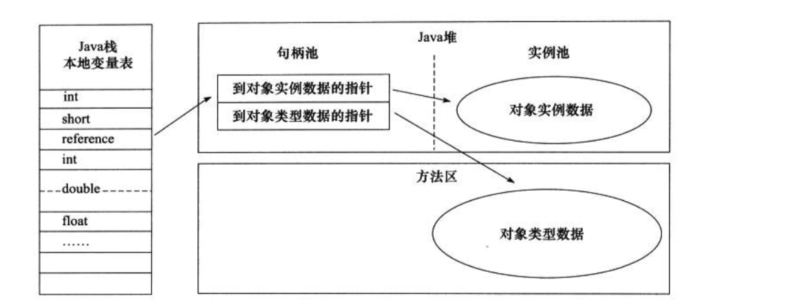
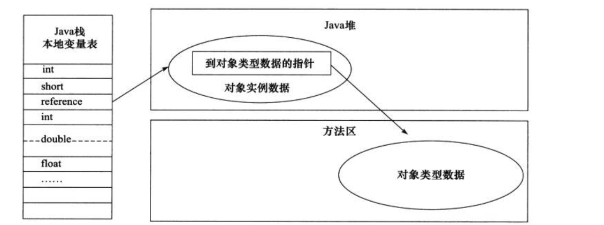
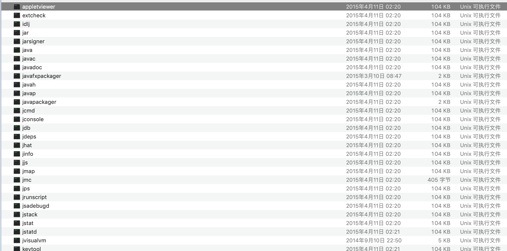
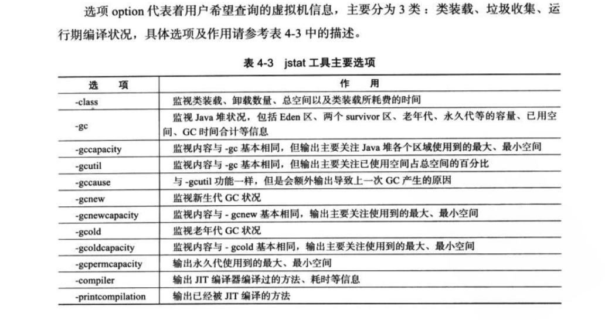
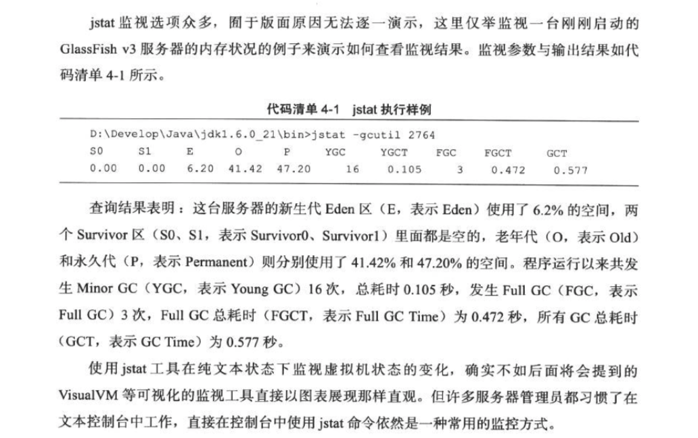

> 本文为本人学习《深入理解Java虚拟机》一书的笔记整理和知识点总结，为方便学习形成记录。

<!-- more -->
## 一. Java 内存区域

#### 1. 程序计数器

1. 为较小的一块内存空间，线程所执行的字节码的行号指示器。
2. 每个线程所独有的，线程切换后能恢复到正确的执行位置，正式依赖于它。
3. 如果线程执行Java方法，计数器记录正在执行的虚拟机字节码指令的地址；如果执行的是Native方法，计数器值为空（undefined）。
4. 程序计数器是Java虚拟机规范中唯一一个没有规定任何OutOfMemoryError的区域。

#### 2. Java 虚拟机栈

1. 线程私有的，生命周期与线程相同。

2. 虚拟机栈描述的是Java方法执行的内存模型，方法执行的时候会创建一个栈帧(Stack Frame)用于存储局部变量表、操作数栈、动态链接、方法出口等信息。

3. **局部变量表**：存放了编译器可知的各种基本数据类型、对象引用、returnAddress类型。

   1. 基本数据类型（boolean, byte, char, short, int, float, long, double)。
   2. 对象引用：reference类型，指向对象地址的指针或执行代表对象的句柄（其他与此对象相关的位置）。
   3. returnAddress类型：指向了一条字节码指令的地址。

   `64位长度的long和double类型数据会占用2个局部变量空间（Slot），其他的数据类型只占用1个。`

   `方法运行期间不会改变局部变量表的大小`

4. 两种异常：

   - StackOverflowError异常：如果线程请求的栈深度大于虚拟机所允许的深度，抛出此异常。
   - OutOfMemoryError异常：如果扩展式无法申请到足够的空间，抛出此异常。

#### 3. 本地方法栈

​	本地方法栈（Native Method Stack）与虚拟机栈的作用非常类似，本地方法栈为虚拟机使用到的Native方法服务。规范中并没有对使用语言、方法和数据结构强制规定，可以由虚拟机自由实现它，抛出的异常和Java虚拟机栈一样。

#### 4. Java堆

1. Java堆（Java Heap）是Java虚拟机管理内存中的最大一块区域，为所有线程所共享，并且在虚拟机启动时创建。
2. 几乎所有对象（new Object）和数组都会存储在Java堆上。
3. Java堆可以处于物理上不联系的内存空间中，只要逻辑上是连续的就可以。
4. 目前主流虚拟机都是按照可扩展来实现的（通过 -Xmx和 -Xms控制）。
5. OutOfMemoryError异常：没有内存完成实力分配，并且堆也无法再扩展时，会抛出此异常。

#### 5. 方法区（永久代）

1. Java8取消了方法区（Non-Heap），原因是不好管理，改为采用Native memory来实现方法区。
2. 主要存放加载的类信息、常量、静态变量等数据。
3. 内存分配无法满足时会抛出OutOfMemoryError异常。

#### 6. 运行时常量池

1. 方法区的一部分。
2. Java并不要求常量一定只有编译器才能产生。

#### 7. 直接内存

## 二. 关于对象

#### 1. 对象的创建

1. 虚拟机遇到new指令时，首先检查这个指令的参数是否能在常量池中定位到一个类的符号引用，并且检查其是否已被加载、解析和初始化过。如果没有，必须先执行响应的类加载过程。
2. 在类加载检查通过后，虚拟机将为新生对象分配内存，对象需要内存的大小在类加载完成后变可完全确定。
3. 内存分配完成后，虚拟机将分配到的内存空间都初始化为零值，为了保证对象实例字段在Java代码中可以不赋初始值就直接使用，这些字段的数据类型所对应的零值。
4. 接下来虚拟机要对对象进行必要的设置，例如是哪个类的实例、类的元数据信息、对象的哈希码、对象的GC分代年龄等。
5. 从虚拟机的视角来看，一个新的对象已经产生了，对于Java程序视角来看，对象的创建才刚刚开始，<init> 方法还没有执行，所有字段还都为零或空。一般来说，执行new指令之后会接着执行<init>方法。

#### 2. 对象的内存布局

- **对象头（Header）：**包括两部分信息，一部分用于存储对象自身的运行时数据，如HashCode、GC分代年龄、锁状态标志、线程持有的锁、偏向线程ID、偏向时间戳等，官方称它为''Mark Word"。对象头的另一部分是类型指针，虚拟机同个这个指针来确定这个对象是哪个类的实例。
- **实例数据（Instance Data）**： 是对象真正存储的有效信息，也是在程序代码中所定义的各种类型的字段内容。
- **对齐填充（Padding）**： 不是一定存在的，仅仅起到占位符的作用。HotSpot VM 的自动内存管理系统要求对象的起始地址必须是8个字节的整数倍，也就是说对象的大小必须是8字节的整数倍。

#### 3. 对象的访问定位

- 使用句柄方式访问：当对象被移动（GC）时只会改变句柄中的数据指针，而栈中reference本身不需要修改。

  

- 使用直接指针方式访问：速度快，节省了一次指针定位的时间开销。Sun HotSpot使用的这种方式。

  

## 三. OutOfMemoryError 异常

​		在Java虚拟机规范中，除了程序计数器外，虚拟机内存的其他几个运行时区域都有发生OutOfMemoryError异常的可能，

#### 1. Java堆溢出

​		Java堆用于存储对象实例，只要不断地创建对象，并且保证GC Roots 到对象之间有可达路径来避免垃圾回收机制清除这些对象，那么在对象数量到达最大堆的容量限制后就会产生内存溢出异常。

​		Java堆内存的额OOM异常是常见的内存溢出异常情况，提示信息为“Java Heap space”。

​		要解决这个区域的异常，一般的手段是先通过内存映像分析工具对Dump出来的堆转储快照进行分析，重点是确认内存中的对象是否是有必要的，也就是要分清楚到底是出现了**内存泄漏（Memory Leak）** 还是**内存溢出（Memory Overflow）**。

​		**如果是内存泄漏，**可以进一步通过工具查看泄漏对象到 GC Roots 的引用链。找到泄漏对象是通过怎样的路径与 GC Roots 相关联并导致垃圾收集器无法自动回收他们的。掌握了泄漏对象的类型信息及 GC Roots 引用链的信息，就可以比较准确的定位出泄漏代码的位置。

​		**如果不存在泄漏，**就是内存中的对象却是还有必要存活着，那就应当**检查虚拟机参数（-Xmx 和 -Xms）**， 与物理内存对比看是否还可以调大，从代码上检查是否存在某些对象生命周期过长、持有状态时间过长的情况，尝试减少程序运行期的内存消耗。

​		以上为简单的处理思路。

#### 2. 虚拟机栈和本地方法栈溢出

​		由于在HotSpot 虚拟机中并不缺分虚拟机栈和本地方法栈，因此对于HotSpot来说虽然 -Xoss 参数存在，但实际上是无效的，栈容量只由 -Xss 参数设定。Java虚拟机规范中描述了两种异常如下：

- 如果线程请求的栈深度大于虚拟机所允许的最大深度，将抛出 StackOverflowError 异常
- 如果虚拟机在扩展栈时无法申请到足够的内存空间，则抛出 OutOfMemoryError 异常

​      **在单个线程下，**无论是由于栈帧太大还是虚拟机栈容量太小，当内存无法分配的时候，虚拟机抛出的都是StackOverflowError异常。

​		**在多线程下，**通过不断地创建爱你线程的方式是可以产生 OutOfMemoryError 异常的，在这种情况下，为每个线程的栈分配的内存越大，反而越容易产生内存溢出异常。

​		在使用多线程开发的情况下，出现StackOverflowError 比较容易找到问题所在。**使用虚拟机默认参数，站深度在大多数情况下，达到1000~2000完全没有问题，这个深度应该完全够用了。**但是如果是建立过多线程导致的内存溢出，再不能减少线程数的或者更换64为虚拟机的情况下，就只能通过减少最大堆和减少栈容量来换取更多的线程。

#### 3. 方法区和运行时常量池溢出 `todo`

​		重点关注String.intern()方法，该方法是一个Native方法。

​		方法区溢出也是一种常见的内存溢出异常，一个类要被垃圾收集器回收掉，判定条件是比较苛刻的。在经常动态生成大量Class的应用中，需要特别注意类的回收情况。

#### 4. 本机直接内存溢出 `todo`

## 四. 垃圾收集器与内存分配策略

​		在Java内存运行时区域的各个部分，其中程序计数器、虚拟机栈、本地方法栈3个区域随着线程而生，随着线程而灭；分配多少内存基本上是在类结构确定下来时久已知的，一次这几个区域的内存分配和回收都具备确定性，不需要考虑回收的问题。

​		而Java堆和方法区则不一样，一个借口中的多个实现类需要的内存可能不一样，一个方法中的多个分支需要的内存也可能不一样，我们只有在程序处于运行期间时才可能知道会创建哪些对象，这部分内存的分配和回收也仅指这一部分内存。

### 1 关于对象

#### 1.1 对象的生死

​		在堆里面存放着Java世界中几乎所有的对象实例，垃圾收集器在对堆进行回收前，第一件事情就是要确定这些对象之中哪些对象还“存活”着，哪些对象已经“死去”（即不可能再被任何途径使用的对象）。

#### 1.2 引用计数算法

​		给对象中添加一个引用计数器，每当有一个地方引用它时，计数器值就加1；当引用失效时，计数器值就减1；任何时可计数器为0的对象就是不可能再被使用的。

​		引用计数器实现简单，判定效率也很高，但是**主流的Java虚拟机里面没有选用引用计数器算法来管理内存**，其中最主要的原因是它很难解决**对象之间相互循环引用的问题**。

#### 1.3 可达性分析算法

​		在主流的商用程序语言（Java，C#）中都是通过可达性分析来判定对象是否存活的。这个算法的基本思路就是通过一些列的称为“GC Roots” 的对象作为起始点，从这些节点开始向下搜索，搜索所走过的路径称为引用链，当一个对象到GC Roots没有任何引用链项链时，则证明此对象是不可用的。

​	GC Roots的对象包括下面几种：

- 虚拟机栈（栈帧中的本地变量表）中引用的对象。
- 方法区中类静态属性引用的对象。
- 方法区中常量引用的对象。
- 本地方法栈中JNI（Native方法）引用的对象。

#### 1.4 引用的强弱

​		无论是通过引用计数算法判断对象引用数量，还是可达性分析算法判断引用链是否可达，都与“引用”有关。

​		Java中规定，如果reference类型的数据中存储的数值代表的是另外一块内存的起始地址，就成这块内存代表着一个引用。但是描述一些“食之无味，弃之可惜”的对象就显得无能为力。JDK1.2之后对引用的概念进行了扩充。

​		我们希望当内存足够时，能保留在内存中，当GC回收后，内存还是非常紧张时，则可以抛弃这些对象。很多系统的缓存功能都符合这样的应用场景。

- 强引用：类似“Object obj = new Object()”这类的引用，只要引用还存在，垃圾收集器永远不会回收。
- 软引用：在系统将要发生内存溢出异常之前，会把这些对象进行第二次回收。如果这次回收还没有足够的内存，才会抛出内存溢出异常。SoftReference类来实现软引用。
- 弱引用：被弱引用关联的对象只能生存到下一次垃圾回收发生之前。无论当前内存是否足够，都会回收掉。WeakReference类来实现弱引用。
- 虚引用：一定会被回收，回收的时候可以收到一个系统通知。PhantomReference类来实现虚引用。

#### 1.5 finalize() 方法

​		建议不要重写此方法，最好忘掉这个方法的存在^_^。

### 2. 垃圾收集算法

​		由于垃圾收集算法的实现涉及大量的程序细节，哥哥平台的虚拟机操作内存的方法有各不相同，本文只介绍几种算法的思想及其发展过程。

#### 2.1 标记-清除算法

​		最基础的收集算法，分为“标记”和“清除”两个阶段，首先标记出所有需要回收的对象，之后进行统一回收所有被标记的对象，后续的收集算法都是基于这种思路并对其不足进行改进。

​		效率比较低，会产生大量不连续的内存碎片。

#### 2.2 复制算法

​		`适合在对象存活率较低时使用。`

​		解决效率问题，现在的商业虚拟机都采用这种收集算法来回收**新生代** ， 将内存分为一块较大的Eden空间和两块较小的Survivor空间，每次使用Eden和其中一块Survivor空间。当回首时，将Eden和Survivor中还存活着的对象一次性的复制到另外一块Survivor空间上，最后清理掉Eden和刚才用过的Survivor空间。**HotSpot虚拟机默认Eden和Survivor的大小比例是8：1，**如果另外一块Survivor空间没有足够空间存放上一次新生代收集下来的存活对象时，对象将直接通过分配担保机制进入老年代。

#### 2.3 标记 - 整理算法

​		`适合在对象存活率较高时使用`

​		根据老年代的特点所出现，标记过程与“标记-清除”算法一样，后续步骤不是直接对可回收对象进行清除，而是让所有存活的对象都向一端移动，然后直接清除掉边界以外的内存。

#### 2.4 分代收集算法

​		当前商业虚拟机的垃圾收集都采用“分代收集”算法，这种算法并没有什么新思想，知识根据对象存活周期的不同将内存划分为几块。Java把堆分为新生代和老年代。

​		新生代每次垃圾回收是都发现有大批对象死去，少量存活，所以选用复制算法。

​		老年代因为对象存活率较高、没有额外空间对它进行分配担保，必须使用“标记-清理”或者“标记-整理”算法来进行回收。

### 3 HotSpot 的算法实现 `todo`

#### 3.1 枚举根节点

#### 3.2 安全点

#### 3.3 安全区域

### 4 垃圾收集器

#### 4.1 G1 收集器

​		G1 收集器是当今收集器技术发展的最前沿成果之一。

#### 4.2 理解 GC 日志

#### 4.3  GC 回收参数

### 5 内存分配与回收策略

​		对象主要分配在新生代的Deden区上，如果启动了本地线程分配缓冲，将按线程优先级在TLAB上分配。少数情况下也可能是会直接分配在老年代中，分配规则并不是百分百固定的，七夕节取决于当前使用的是哪一种垃圾收集器组合，还有虚拟机中与内存相关的参数的设置。

#### 5.1 对象优先在Eden分配

​		多数情况下，对象在新生代Eden区中分配，当其空间不足时，虚拟机发生一次Minor GC。

​		虚拟机提供了 -XX：+PrintGCDetails 这个收集器日志参数，来打印日志。

#### 5.2 大对象直接进入老年代

​		大对象是指，需要大量连续内存空间的Java对象，最典型的大对象就是那种很长的字符串以及数组。大对象对虚拟机的内存分配来说就是一个坏消息，如果是短命的大对象就会更头疼了，会导致内存还有不少空间时就提前触发垃圾收集以获取足够的连续空间来“安置”他们。

​		虚拟机提供了一个 -XX:PretenureSizeThreshold 参数，零大于这个设置值得对象直接在老年代分配，这样做的目的是避免在Eden区及两个Survivor区之间发生大量的内存复制（新生代采用复制算法收集内存）。

#### 5.3 长期存活的对象进入老年代

​		`-XX:MaxTenuringThreshold` 设置对象年龄，默认为15岁。

​		虚拟机给每个对象定义了一个对象年龄（Age）计数器，对象在Eden区出生，每经过一次Minor GC（在两个Survivor区移动），每经过一次就会增加1岁，他的年龄增加到设置的阈值就会晋升到老年代，通过上面的参数设置。

#### 5.4 动态对象年龄判定

​		虚拟机并不是永远地要求对象的年龄必须达到阈值才能晋升老年代，如果在Survivor空间中相同年龄所有对象大小的总和大于Survivor空间的一半，年龄大于或等于改年龄的对象就可以直接进入老年代，无需等到阈值中要求的年龄。

#### 5.5 空间分配担保

​		在发生Minor GC之前，虚拟机会先检查老年代最大可用的连续空间是否大于新生代所有对象总空间，如果条件成立，那么Minor GC 可以确保是安全的。如果不成立，则虚拟机会查看 HandlePromotionFailure 设置值是否允许担保失败。 如果允许，那么会继续检查老年代最大可用的连续空间是否大于历次晋升到老年代对象的平均大小，如果大于，将尝试着进行一次Minor GC，尽管这次 Minor GC是有风险的； 如果小于，或者 HandlePromotionFailure 设置不允许冒险，那这时也要改为进行一次Full GC。

## 五. JVM性能监控与故障处理工具

​		Java开发人员肯定都知道JDK的bin目录中有“java.exe”、“javac.exe”这两个命令行工具，其他的很多工具就是用于调试和性能分析的工具。

#### 1 Java 命令行工具 

-  **jps - JVM进程状况工具**

​		命令格式：`jps [ option ] [ hostid ]`

​		jps(JVM Process Status Tool) 和unix的ps命令类似：可以列出正在运行的虚拟机进程，并显示虚拟机执行主类(Main Class, main()函数所在的类)名称以及这些进程的本地虚拟机唯一ID。是使用频率最高的JDK命令行工具。

-  **jstat - JVM统计信息监控工具**

​		jstat（JVM statistics Monitoring Tool） 用于监视虚拟机各种运行状态信息的命令行工具。他可以显示本地或者远程虚拟机进程中的类装载、内存、垃圾收集、JIT编译等运行受，在没有GUI图形界面，只提供了纯文本控制台环境的服务器上，它将是运行期定位虚拟机性能问题的首选工具。

​		命令格式：`jstat [ option vmid [interval[s|ms]] [count] ] `

​		参数interval和count代表查询间隔和次数，如果省略，说明只查询一次。假设需要每250毫秒查询一次进程2764垃圾收集状况，一共查询20次，命令应当是：`jstat -gc 2764 250 20`

- **jinfo - Java配置信息工具**

​		jinfo（Configuration Info for Java） 的作用是实时查看和调整虚拟机各项参数。

​		使用jps 命令的-v参数可以查看虚拟机启动时显式指定的参数列表。

​		使用jinfo命令的-flag选项查询所有的参数列表。

​		使用jinfo -flag [+|-] name或者name=value 修改一部分运行期科协的虚拟机参数值。

​		命令格式：`jinfo [ option-] pid`

- **jmap - Java内存映像工具。**

​		jmap（Memory Map for Java）命令用于生成，获取堆转储快照、查询finalise执行队列、Java堆和永久代的详细信息。

​	命令格式：`jmap [ option] vmid`

- **jhat - 虚拟机堆转储快照分析工具**

​		用于和jmap搭配使用分析jmap生成的堆转储快照。jhat内置了一个卫星的http/html服务器生成dump文件在浏览器中查看。

​		实际工作中很少使用，可使用visualVM代替。

- **jstack - Java堆栈跟踪工具**

​		就stack命令用于生成虚拟机当前时刻的线程快照（threaddump或者Javacore文件）。线程快照就是当前虚拟机内每一条线程正在执行的方法堆栈的集合，生成线程快照的主要目的是定位线程出现长时间停顿的原因，如线程间死锁、死循环、请求外部资源导致的长时间等待都是导致线程长时间停顿的常见原因。

​			命令格式：`jstack [ option] vmid`

#### 2 JDK 可视化工具

- **JConsole：Java监视与管理控制台**

- **VisualVM： 多合一故障处理工具**

  1. 显示虚拟机进程以及进程的配置、环境信息（jps、jinfo）。
  2. 监视应用程序的CPU、GC、堆、方法区以及线程的信息（jstat、jstack）。
  3. dump以及分析堆转储快照（jmap、jhat）。
  4. 方法级的程序运行性能分析，找出被调用最多、运行时间最长的方法。
  5. 离线程序快照：收集程序的运行时配置、线程dump、内存dump等信息建立一个快照，可以将快照发送开发者处进行Bug反馈。
  6. 其他plugins的无限的可能性……

  

